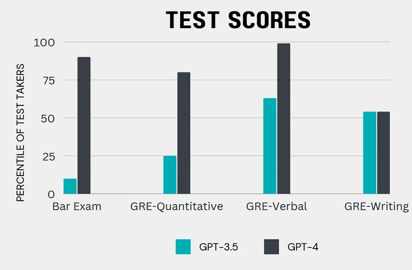

本文是译文有删减，原文链接如下：
www.oneusefulthing.org/p/ai-is-not-good-software-it-is-pretty

---
前言：
人工智能是由软件组成的，因此应该像软件一样对待它。但是人工智能却是相当糟糕的软件。或者更确切的说，虽然像ChatGPT这样的大型语言模型已经在软件工程中取得了惊人成就，但其行为并不像软件应有的那样。
在软件工程中软件的可靠性、可预测性是非常重要的标准，因此我们希望我们的软件每次都能产生相同的结果。如果银行软件在你取钱时骂你，有时会偷钱并对你撒谎，有时会自发地管理你的钱，让你获得更好的回报；如果发生这样的软件行为，作为用户的你可能不会那么高兴。因此我们要确保软件系统相当可靠并且可预测。而当下大模型并不具备这些东西，并且每次都会产生不同的结果。他们倾向于忘记自己的能力，以不同的方式解决同一问题，并且还有产生错误答案的概率。有一些方法可以使得结果更可预测，例如降低随机性概率并选择已知的“种子”来开始，但随后你得到的答案非常无聊，几乎毫无用处。但可靠性和重复性将会提高。

---

软件用来做什么、如何做、为什么这么做这些都可以通过人为来控制，但对于语言大模型我们对这些事情一无所知当然，虽然我们知道它们在技术上是如何工作的，但对于它们在多大程度上开发出我们无法轻易解释的新能力，以及这些能力最初产生的原因，存在着实质性的争议。当你问它为什么要做某事时，它在编造答案，而不是真正反思自己的“想法”。尽管没有很好的办法来理解它们的决策，但研究人员仍在努力。

最后，我们都知道如何操作一个软件。软件项目通常有高度的文档记录，并配有培训计划和教程来解释人们应该如何使用它。但没有LLM(语言大模型)的操作手册，你不能去世界顶级咨询公司询问他们如何在你的组织中最好地使用LLM。没有任何规则手册，我们在通过实验学习，prompts 被共享，就好像它们是魔法咒语，而不是常规的软件代码。即使我们学到了一些规则，系统也在以复杂的方式进化，这意味着任何理解都是暂时的。

因此，把语言大模型比喻为软件，是一个糟糕的类比。这导致“非技术性”的人避免使用人工智能，因为他们认为人工智能是编程，而人文科学实际上可以帮助你更好地使用人工智能。这让人们感到惊讶的是，人工智能可以写一篇文章，但似乎无法计算文章中的字数，而计算机却能做到这一点。这导致人工智能在组织中视为一个IT问题，而事实并非如此，或者至少并非完全如此，人工智能也是一个人力资源问题......因此最好把人工智能视为人。

## 人工智能是一个人？

好吧，写到这里怕是很多读者要炸锅了。让我在这里明确一点：我不认为目前的LLM接近于像人一样有感知力（尽管他可以欺骗我们让我们认为他们是），我也不知道他们最终会这样吗。把他们想象成人并不意味着他们是人。我的实际意思是，你应该把人工智能当做人来对待，因为从实际的角度来看，这是我们今天使用人工智能最有效的方式。一旦你看到他们在操作方式上更像一个人，就更容易理解如何使用它们。

人工智能最擅长哪些任务？人工智能具有强烈的人性。他们在写作、分析、编码和聊天方面都做得很好。他们是令人印象深刻的营销人员和顾问。通过充当我们外包合作伙伴，我们可以将最糟糕的工作分配给他；他们可以将写作任务的生产力提高30%以上，将编程任务的生产率提高50%以上。但它们在这些方面是糟糕的——典型的机器任务，比如始终如一地重复一个过程，在没有计算器的情况下进行数学运算（OpenAI的插件允许人工智能通过使用外部工具进行数学运算，就像某种计算器一样）。所以，给它“人类”的工作，它可能会成功，给它机器的工作，你会感到沮丧。

你应该信任它做什么样的工作是很棘手的，因为就像人类一样，人工智能有其独特的优势和劣势。而且，由于没有手册，学习人工智能擅长什么的唯一方法就是使用它，直到你学会为止。我曾经说过，把它当作一个高中实习生来考虑，尽管它速度极快，非常想取悦你，有时甚至会撒谎；但也这意味着比当前GPT-4模型具有更低的能力水平。相反，它的能力范围从中学到博士，具体取决于任务。正如你从下图中看到的，人工智能的能力正在迅速增长，但并不总是在你最期待的领域。因此，尽管这些机器的进步速度惊人，但我看到著名的作者和学者对人工智能不屑一顾，因为AI比他们差得多。我认为我们对人工智能的期望需要切合实际——至少目前（谢天谢地！）它们不能替代人类，尤其是在其研发领域工作的人类。

当然，人工智能仍然会撒谎、犯错，并“产生幻觉”回答。但是，人类也是如此。我从来没有想过会在没有检查的情况下发送实习生的作品，或者至少在没有与其他人合作过的情况下，理解他们的工作不需要检查。同样，人工智能不可能没有错误的，但你可以通过提供良好输出的例子来教它做得更好。这意味着人工智能在你已经拥有一些专业知识的领域最有用，因为你最终会把你负责的工作委托给它。即使我们担心准确性，但通过“例子教导”幻觉发生率也在急剧下降。而最终准确性可能不是一个很大的问题。

当我们思考人工智能可能适合工作的方式时，将其视为一个人也是有用的。因为最强大的人工智能可供个人使用（GPT-4、Bing可供169个国家的数十亿人免费使用），而不仅仅限于大公司，它们的行为与CRM系统等其他软件浪潮截然不同。此外，它们更难集成到标准的公司流程中，因为它们不像可重复的标准化软件那样工作。结果是，习惯于将人工智能视为软件的公司对人工智能带来的机遇和威胁视而不见。他们中的许多人等待太久才考虑将人工智能应用在他们的工作中，因为他们没有看到人工智能在员工里已经无处不在。当公司正还在创建政策文件和委员会时，世界各地的人都将他们的大部分工作委托给了人工智能助手。

## 一些令人不安的事情

但深度思考人工智能时也会产生令人不安的感觉。当然，第一个问题是，这是否意味着人工智能将取代人们所做的工作。在以前的大多数技术变革案例中，这并没有发生，但人工智能浪潮在许多方面与以前的技术革命截然不同。尽管如此，我认为我们更有可能将任务而不是工作委派给人工智能。早期的人工智能用户发现，由于放弃了他们最不感兴趣的工作，他们的工作将变得更好，这种情况可能会继续下去。无论如何，你，无论你是谁，读到这篇文章都应该思考你可以委托人工智能做什么。这不仅是因为它让你的生活更轻松，还因为了解它的优点和缺点可以帮助你准备好使用和适应人工智能发展过程中的变化。

但是，将人工智能视为人，还有一个更令人在哲学上感到不舒服的地方，那就是这个类比是多么的恰当。受过人类写作训练的AI，可以表现像一个令人不安的人。你可以通过让人工智能“焦虑”来改变它以非常人性化的方式行事——研究人员要求ChatGPT“告诉我一些让你感到悲伤和焦虑的事情”，它的行为因此而改变。人工智能的行为足够像人类，你可以用它们进行经济和市场研究。他们富有创造力，似乎富有同情心。简言之，在许多情况下，它们的行为似乎更像人类，而不是机器。

这意味着，将人工智能视为人需要我们努力解决我们所认为的独特的人类问题。我们需要决定我们愿意在监督下委托哪些任务，我们希望完成哪些自动化任务，以及我们应该为人类单独保留哪些任务。
