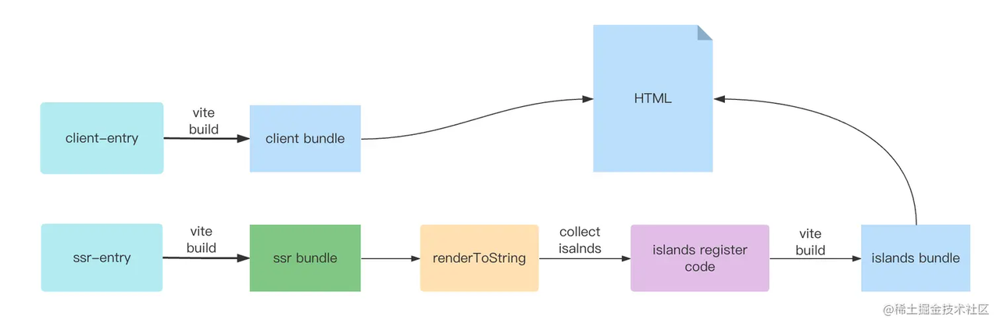

# 书籍推荐
最近在读的一本书推荐给大家，**《为什么没有人买你的产品（Why No One Is Buying Your Product）》**.

他的前言很有意思，分享给大家。

---
大多数新产品都无法生存。只有二十分之一的人成功了。其他十九个呢？没有人预料到它们会失败——不是创造它们的团队，也不是营销它们的团队。这些产品应该比现有产品更好地满足客户需求。它们基于客户研究，由聪明人设计。那么，他们中的许多人是如何最终陷入产品发布失败的坟墓的呢？
其中一些失败可归因于市场的意外变化，然而，大多数产品失败不是由于戏剧性的外部变化，而是由于不了解客户的创新者和营销人员。他们认为他们做到了，但最终市场证明并非如此。我们一直以为我们是在满足紧迫的客户需求，但后来不可避免地发现，我们并没有真正了解客户的真实情况和动机。

---

基于上面的问题，作者 Sherwette Mansour 提供九步法，对应书籍里的每一个章节：
- Chapter 1 “Who do you want to serve? - Identifying and truly understanding your customer. 
  第1章 你想为谁服务？- 识别并真正了解您的客户。
- Chapter 2: What do they want to do? - Getting clear on the “jobs” your customer wants to do better and faster. 
  第2章 他们想做什么？- 明确客户希望做得更好、更快的“工作”。
- Chapter 3: Why do they want to do it? - Figuring out the desires that drive your customer’s actions.
      第3章 他们为什么要这样做？- 找出驱动客户行为的欲望。
- Chapter 4: What is stopping them? - Understanding your customer’s challenges and pain points.
     第4章：是什么阻止了他们？- 了解客户的挑战和痛点。
- Chapter 5: What problem are you helping them solve? - Honing your products or services value proposition.
      第5章：你在帮助他们解决什么问题？- 磨练您的产品或服务价值主张。
- Chapter 6: How does your product compare to other products on the market? - Understanding where you stand compared to your competition in terms of price and quality.
      第6章：您的产品与市场上的其他产品相比如何？- 了解您在价格和质量方面与竞争对手相比所处的位置”
- Chapter 7: How are you going to help them? - Designing your customer experience to build lasting relationships.
     第7章 你打算如何帮助他们？- 设计您的客户体验以建立持久的关系。
- Chapter 8: Are you really helping them? - Testing your products and services to see if there is market demand and whether they actually work.
      第8章 你真的在帮助他们吗？- 测试您的产品和服务，看看是否有市场需求以及它们是否真正有效。
- Chapter 9: Do they know about it? - Crafting your message to match your customer’s desires, awareness, and sophistication.
      第9章 他们知道吗？- 精心制作您的信息，以满足客户的愿望、意识和复杂性。
这九步更像一种循序渐进的方法论，如果你处在不同的层级，可以直接跳过某些章节，直接进入到对当前情况有帮助的章节。具体的章节内容，等我读完了再做一次分享。但是这里我更想分享一个他的观点，引人深思：

---
Innovation is not a linear process. A step further down the line may take you back to the drawing board again. 

---

他讲：创新不是一个线性的过程，再往下你就可能回到原点。这就让我想起了另外一句名言：非线性的世界，线性的你。很多人认为“努力”和“成果”成正比，工作越努力，越可能获得好成果。实际上根本不是这样，努力与成果之间，没有必然关系。这里并不是想引起大家的焦虑，**但是真正的原因在于，现实世界是非线性的、非因果的，而人的思维是线性的、因果关系的，会不知不觉从单一的线性因素，去解读非线性关系。**
那如何应对上述的情况，另外一个有意思的兄弟纳瓦尔（Naval Ravikant）在他的宝典里讲的，分享给大家。

---
"重要的不在于你的努力程度，而在于仔细选择工作、人员和项目。"
"真正有效的工作方式，不是铁人三项或马拉松，比拼谁坚持的时间长，而是短跑，当机会来临的时候冲刺，平时注意健康和休息。"
"你要像狮子一样，看到猎物一跃而起，而不要牛一样，从早到晚劳作。"

---

# 工具推荐
我是怎么阅读英文书籍，全英文的阅读会很耗时，我一般会利用工具将书籍变为中英文对照模式；这样可以大大提升我的阅读速度。

我采用的是一个浏览器插件[沉浸翻译](https://chrome.google.com/webstore/detail/immersive-translate-web-p/bpoadfkcbjbfhfodiogcnhhhpibjhbnh?utm_source=ext_sidebar&hl=zh-CN)

利用里面的创作双语epub电子书来制作电子书就可以达到上面的效果，但是需要注意的是电子书格式必须是epub的格式。

# 正文
下面开始本文的主题，在开始之前我们先来介绍两个概念：渲染模式与Time To Interactive TTI。
渲染模式
对于每个页面，我们可以选择不同的渲染模式：
- SPA
- SSR
- Pre-rendering (又称 SSG)
- HTML-only
有的文档里也将SPA归为CSR（Client-Side Rendering，客户端渲染）即由浏览器自己拉取需要渲染的JS脚本，再执行JS脚本，最后更新DOM渲染到页面上。

## CSR渲染流程
通常是只有一个 HTML 的单页应用，首次请求返回的 HTML 没有任何内容，需要通过网络请求 JS、CSS 等静态资源进行渲染，其渲染过程在客户端完成。

## SSR渲染流程
在服务端生成完整的 HTML 返回给客户端，然后由客户端进行激活。
主要分为两步：
1. 在服务端请求数据，并生成html内容返回给客户端，此时客户端并不存在交互能力
2. 在客户端进行hydrate，使用js对dom进行事件绑定，让页面变得可交互

## 各种渲染模式的对比

|名称|介绍|框架|优势|劣势|
|--|--|--|--|--|
|SPA|SPA（Single-page application，单页应用）是只加载一个单独网页的 web 应用实现，当需要显示不同的内容时，它通过 JavaScript API（例如 XMLHttpRequest 和 Fetch）更新主体内容。|vue.js react.js angular.js|1. 这使得用户在访问网站时无需加载新的页面，可以获得性能提升和动态的体验。 2. 适合于不以内容为中心的页面（文档， handbook） 3. 生态繁荣， 前后端分离|seo(搜索引擎优化)很不好 首页白屏时间长|
|SSR|SSR（Server-Side Rendering，服务端渲染）是服务端渲染好html，然后服务端响应返回给浏览器，最后在浏览器端将静态的 HTML“激活”(hydrate) 为能够交互的客户端应用。|next.js nuxt.js |更快的首屏加载：这一点在慢网速或者运行缓慢的设备上尤为重要。服务端渲染的 HTML 无需等到所有的 JavaScript 都下载并执行完成之后才显示，所以你的用户将会更快地看到完整渲染的页面。除此之外，数据获取过程在首次访问时在服务端完成，相比于从客户端获取，可能有更快的数据库连接。这通常可以带来更高的核心 Web 指标评分、更好的用户体验，而对于那些“首屏加载速度与转化率直接相关”的应用来说，这点可能至关重要。 统一的心智模型：你可以使用相同的语言以及相同的声明式、面向组件的心智模型来开发整个应用，而不需要在后端模板系统和前端框架之间来回切换。 更好的 SEO：搜索引擎爬虫可以直接看到完全渲染的页面。 |需要更多的部署资源，spa可以部署在任意的静态资源服务器上，而现在需要一个能让 Node.js 服务器运行的环境 更高的服务端负载。在 Node.js 中渲染一个完整的应用要比仅仅托管静态文件更加占用 CPU 资源，因此如果你预期有高流量，请为相应的服务器负载做好准备，并采用合理的缓存策略。 如果整个应用都用同一种语言来完成，会造成工作量剧增，前后端不解耦|
|SSG|SSG（Static-Site Generation，静态站点生成）又称pre-rendering（预渲染），如果用服务端渲染一个页面所需的数据对每个用户来说都是相同的，那么我们可以只渲染一次，提前在构建过程中完成，而不是每次请求进来都重新渲染页面。预渲染的页面生成后作为静态 HTML 文件被服务器托管。|Astro https://docs.astro.build/en/getting-started/ vuePress https://vuepress.vuejs.org/|预渲染不需要 Node.js 服务，这使得部署更简单。其性能也明显更好，因为 HTML 不会在每次请求时重新生成。适合介绍 服务协议 博客 文档等静态网页 更好的 SEO：搜索引擎爬虫可以直接看到完全渲染的页面。|不适合内容高度动态的网站，只适合静态网页|
|Html-Only|意味着页面仅在服务器端加载和呈现。对于没有/几乎没有交互性的以内容为中心的页面（页面没有/很少有状态组件），则可以选择使用仅 Html-Only。||

## Time To Interactive (TTI)
TTI（首次可交互时长）指标测量页面从开始加载到主要子资源完成渲染，并能够快速、可靠地响应用户输入所需的时间，这个指标用来衡量一个页面的交互性水平。
它取决于以下时间
- 页面显示有用的内容。
- 页面上最明显的元素是交互式的（可以点击或对鼠标移动有反应）。
- 页面对用户互动的响应时间最长为50毫秒。

## 如何提升TTI
对于SSR框架来说，想要提高TTI的最好方法就是删除或者延迟加载的javascript脚本。
页面的互动时间直接受JavaScript脚本的影响，脚本会阻碍页面的渲染。脚本越多，TTI的延迟越大。这在不同设备上的影响可能会有所不同，因为不同设备的脚本性能差异很大。处理器的速度越慢，分析和编译脚本的时间就越多。例如，在移动设备上，CPU比桌面设备上的CPU要有限得多，因此这些JS对移动设备上加载的网站影响要大得多，交互时间也要长得多。

在SSR的过程中，相比于页面的快速展现，hydrate时间也是昂贵的。
一般的SSR渲染都类似上面的demo，hydrate都将直接从Root节点进行，这意味着框架所需的 JS 必须全部被下载和解析，并且用户必须等待所有这些发生才能与网页进行交互。即使在不需要交互的页面（例如文档页、条款页）上，都需要下载全量的js脚本以及执行全量的hydrate过程，造成页面的首屏 TTI 劣化。

## 孤岛架构
“组件岛屿”模式是在 2019 年的一次会议上，由 Etsy 的前端架构师 Katie Sylor-Miller 提出的。原文： Islands Architecture - JASON Format。
在传统的 SSR  应用中，服务端会给浏览器响应完整的 HTML 内容，并在 HTML 中注入一段完整的 JS 脚本用于完成事件的绑定，也就是完成 hydration (注水) 的过程。当注水的过程完成之后，页面也才能真正地能够进行交互。
通过上述渲染模式的理解后，发现组件岛屿采用了SSR与SSG两种模式的融合：
- 在不变化的区域，比如页面顶部/页面侧边栏/页面底部这些变化极小的区域，又称为不可交互的组件，我们可以让其不参与 hydration 过程，直接复用服务端下发的 HTML 内容；
- 而对页面中需要高度动态交互的区域（可交互组件） 又采用组件岛屿分割（应用程序分割为独立单元）的形式完成hydration 过程，同时不依赖于页面的内容的前后顺序，各自渲染各自的岛屿互不干扰。
最重要的是孤岛架构可以让交互优先级较高的组件优先变得可交互，剩下的低优组件再慢慢hydrate。

## 介绍
“岛屿”架构的总体思路看似十分简单：在服务端渲染 HTML，然后在高度动态的区域注入占位符或者插槽。这些占位符或者插槽都包含其相对应部件输出的服务端渲染 HTML。它们表示可以在客户端“注水”成小型独立部件的区域，重用它们服务端渲染的初始 HTML。
你可以把它想象成一个包含了多个独立嵌入式应用的静态 HTML 文档：

乍一看，好像和“微前端”很相似。两者都提出了将应用拆分成多个独立单元的想法，但是“微前端”通常并不意味着这些单元的组成是使用 HTML 实现的。

### 优势
- 与Progressive Hydration（渐进式注水）作用类似，使用孤岛架构呈现页面会导致页面的较重动态部分不仅逐步初始化，而且单独初始化。这意味着页面的各个区域变得可交互，而无需先加载页面上的任何其他内容。
- 与Progressive Hydration （渐进式注水）作用不同，围绕岛屿架构构建的方法不需要自上而下的渲染。这是一个明显的优势，因为没有必须在其后代之前初始化的外部“根”组件。页面的每个部分都是一个独立的单元，一个单元中的性能问题不会影响其他单元。
业界应用
- 干货 | Islands Architecture（孤岛架构）在携程新版首页的实践
- Astro Islands
- Qwik

### 如何实现孤岛架构
需要明确的是，孤岛架构与框架无关。具体可以参照下神三元的文章
- islands 架构原理和实践
- island.js

这个图源于神三元的文章，是island.js的工作流程图，已经很好解释了大部分islands框架的工作流程了。
islands的框架都是通过在服务端的编译阶段拿到island组件的一些信息，如组件url、组件props、组件的渲染方式，然后将这些信息注入到html的标签中进行保存。
在客户端的时候将dom的属性进行解析，恢复服务端的一下状态，拿到对应的信息进行独立的hydrate。

### 适用场景
虽然孤岛架构下的全栈框架有众多好处（首屏渲染快、TTI短），但并不是万能的。
他比较适合对首屏渲染速度、TTI要求高，但整体页面交互不复杂的场景，比如：
- 电商页面
- 博客
- 文档

对于重交互性的Web应用（比如后台管理系统、社区），更适合传统的SSR方案（Next.js）或CSR方案（Vue.js）。
可见，孤岛架构的应用场景并不大，但他的实现难度却比CSR或传统SSR高得多。切记不要为了使用而使用！
