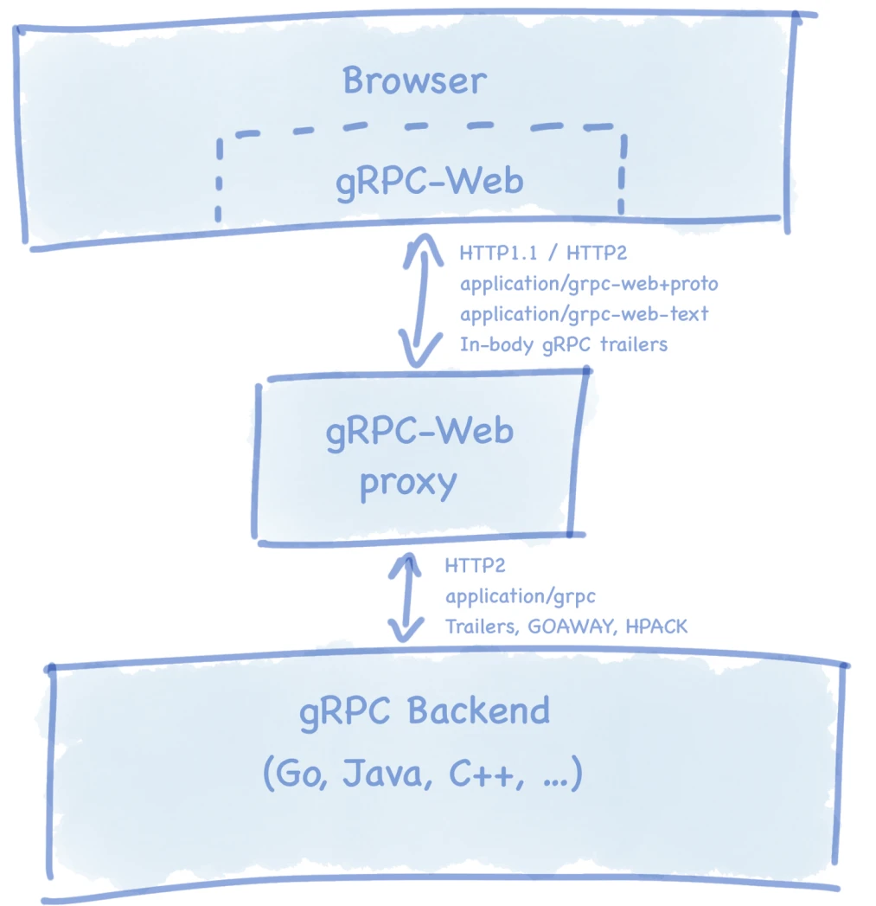
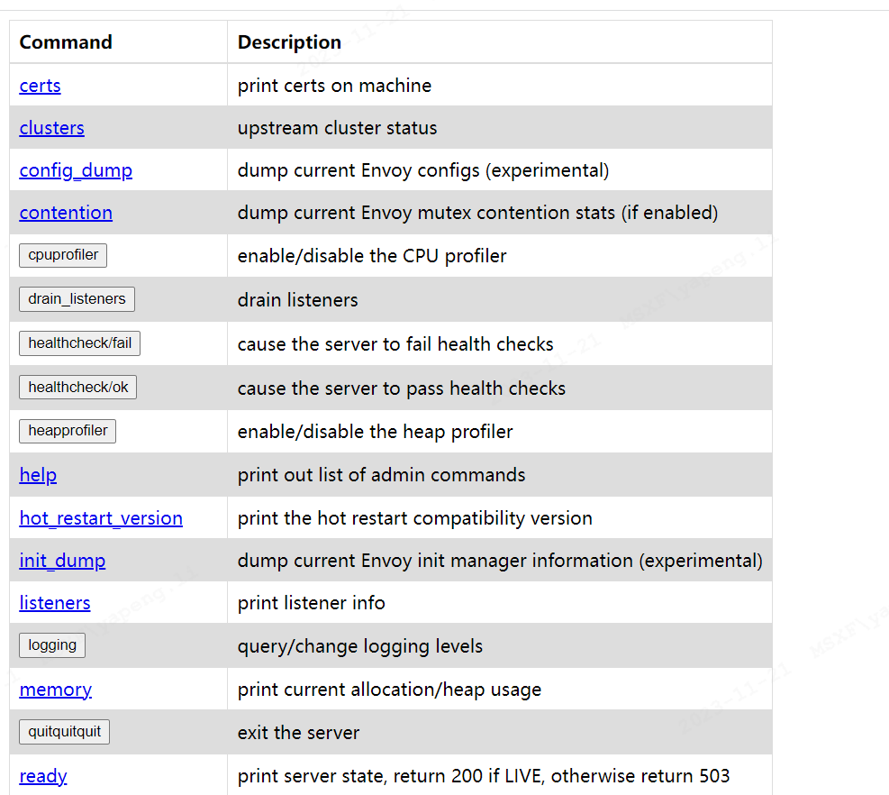

# grpc-web介绍

gRPC-web是谷歌开发的用于浏览器与gRPC服务进行开源库，其中浏览器端与gRPC服务进行交互需要通过特殊的第三方proxy（代理服务），官方推荐的是Envoy（一种云原生的代理服务），而大名鼎鼎的Nginx也可以实现。




需要注意的是，gRPC-web当前仅支持如下RPC的模式：

- Unary RPCs（一元的RPC模式）： 客户端发送请求，服务端响应
- Server-side Streaming RPCs（服务端流式）：客户端发送一次请求，服务端多次响应
而客户端流式以及双向流式的RPC模式暂时不支持，并在以后gRPC-web也不会支持，具体参考： 流式路线；但Google提供了一种新的实验阶段的浏览器端与服务端之间的双向通信的API: WebTransport。

# gRPC-web实现步骤

## 准备工作
- 准备mac环境
- 下载protoc以及protoc-gen-grpc-web插件

```shell
brew install protoc
brew install protoc-gen-grpc-web
```

## 用protocol buffer 定义rpc服务

```proto
syntax = "proto3";

package grpc.gateway.testing;

message Empty {}

message EchoRequest {
  string message = 1;
}

message EchoResponse {
  string message = 1;
  int32 message_count = 2;
}

// Request type for server side streaming echo.
message ServerStreamingEchoRequest {
  // Message string for server streaming request.
  string message = 1;

  // The total number of messages to be generated before the server
  // closes the stream; default is 10.
  int32 message_count = 2;

  // The interval (ms) between two server messages. The server implementation
  // may enforce some minimum interval (e.g. 100ms) to avoid message overflow.
  int32 message_interval = 3;
}

// Response type for server streaming response.
message ServerStreamingEchoResponse {
  // Response message.
  string message = 1;
}

// Request type for client side streaming echo.
message ClientStreamingEchoRequest {
  // A special value "" indicates that there's no further messages.
  string message = 1;
}

// Response type for client side streaming echo.
message ClientStreamingEchoResponse {
  // Total number of client messages that have been received.
  int32 message_count = 1;
}

// A simple echo service.
service EchoService {
  // One request followed by one response
  // The server returns the client message as-is.
  rpc Echo(EchoRequest) returns (EchoResponse);

  // Sends back abort status.
  rpc EchoAbort(EchoRequest) returns (EchoResponse) {}

  // One empty request, ZERO processing, followed by one empty response
  // (minimum effort to do message serialization).
  rpc NoOp(Empty) returns (Empty);

  // One request followed by a sequence of responses (streamed download).
  // The server will return the same client message repeatedly.
  rpc ServerStreamingEcho(ServerStreamingEchoRequest)
      returns (stream ServerStreamingEchoResponse);

  // One request followed by a sequence of responses (streamed download).
  // The server abort directly.
  rpc ServerStreamingEchoAbort(ServerStreamingEchoRequest)
      returns (stream ServerStreamingEchoResponse) {}

  // A sequence of requests followed by one response (streamed upload).
  // The server returns the total number of messages as the result.
  // Notice: Client side streaming and Bidi streaming are not supported at the moment.
  rpc ClientStreamingEcho(stream ClientStreamingEchoRequest)
      returns (ClientStreamingEchoResponse);

  // A sequence of requests with each message echoed by the server immediately.
  // The server returns the same client messages in order.
  // E.g. this is how the speech API works.
  // Notice: Client side streaming and Bidi streaming are not supported at the moment.
  rpc FullDuplexEcho(stream EchoRequest) returns (stream EchoResponse); 

  // A sequence of requests followed by a sequence of responses.
  // The server buffers all the client messages and then returns the same
  // client messages one by one after the client half-closes the stream.
  // This is how an image recognition API may work.
  // Notice: Client side streaming and Bidi streaming are not supported at the moment.
  rpc HalfDuplexEcho(stream EchoRequest) returns (stream EchoResponse);
}
```

具体的protocol Buffers语法详解可参考：https://protobuf.dev/

## 服务端实现
基于上述proto协议实现服务端的逻辑，此处省略。

## Envoy代理服务配置
简单理解：Envoy是一个类似nginx的代理服务器，它的作用是桥接浏览器与服务端进行通信。配置文档： https://www.kancloud.cn/linimbus/envoyproxy/498702。本文配置如下：

```yaml
# envoy 管理端
admin:
  access_log_path: /tmp/admin_access.log
  address:
    socket_address: { address: 0.0.0.0, port_value: 9901 }

static_resources:
  listeners:
    - name: listener_0
      address:
        # 前端调用地址
        socket_address: { address: 0.0.0.0, port_value: 8080 }
      filter_chains:
        - filters:
          - name: envoy.filters.network.http_connection_manager
            typed_config:
              "@type": type.googleapis.com/envoy.extensions.filters.network.http_connection_manager.v3.HttpConnectionManager
              codec_type: auto
              stat_prefix: ingress_http
              route_config:
                name: local_route
                virtual_hosts:
                  - name: local_service
                    domains: ["*"]
                    routes:
                      - match: { prefix: "/" }
                        route:
                          cluster: greeter_service
                          timeout: 0s
                          max_stream_duration:
                            grpc_timeout_header_max: 0s
                    cors:
                      allow_origin_string_match:
                        - prefix: "*"
                      allow_methods: GET, PUT, DELETE, POST, OPTIONS
                      allow_headers: keep-alive,user-agent,cache-control,content-type,content-transfer-encoding,custom-header-1,x-accept-content-transfer-encoding,x-accept-response-streaming,x-user-agent,x-grpc-web,grpc-timeout
                      max_age: "1728000"
                      expose_headers: custom-header-1,grpc-status,grpc-message
              http_filters:
                - name: envoy.filters.http.grpc_web
                  typed_config:
                    "@type": type.googleapis.com/envoy.extensions.filters.http.grpc_web.v3.GrpcWeb
                - name: envoy.filters.http.cors
                  typed_config:
                    "@type": type.googleapis.com/envoy.extensions.filters.http.cors.v3.Cors
                - name: envoy.filters.http.router
                  typed_config:
                    "@type": type.googleapis.com/envoy.extensions.filters.http.router.v3.Router
  clusters:
    - name: greeter_service
      connect_timeout: 0.25s
      type: logical_dns
      http2_protocol_options: {}
      lb_policy: round_robin
      # win/mac hosts: Use address: host.docker.internal instead of address: localhost in the line below
      load_assignment:
        cluster_name: cluster_0
        endpoints:
          - lb_endpoints:
            - endpoint:
                address:
                  # 后端服务地址
                  socket_address:
                    address: 0.0.0.0
                    port_value: 9090
```

浏览器请求的地址：

```yaml
address:
        # 前端调用地址
        socket_address: { address: 0.0.0.0, port_value: 8080 }
```

监听的服务端地址

```yaml
clusters:
    - name: greeter_service
      connect_timeout: 0.25s
      type: logical_dns
      http2_protocol_options: {}
      lb_policy: round_robin
      # win/mac hosts: Use address: host.docker.internal instead of address: localhost in the line below
      load_assignment:
        cluster_name: cluster_0
        endpoints:
          - lb_endpoints:
            - endpoint:
                address:
                  # 后端服务地址
                  socket_address:
                    address: 0.0.0.0
                    port_value: 9090
```

envoy管理端，是在部署的机器上envoy的一个web管理端界面



## Envoy docker部署方式
- Dockerfile

```docker
FROM envoyproxy/envoy:v1.22.0

COPY net/grpc/gateway/examples/echo/envoy.yaml /etc/envoy/envoy.yaml

ENTRYPOINT [ "/usr/local/bin/envoy" ]
CMD [ "-c /etc/envoy/envoy.yaml", "-l trace", "--log-path /tmp/envoy_info.log" ]
```

- 启动脚本

```shell
docker build -t grpc-envoy:v1

docker run -d --name grpc-envoy -p 9901:9901 -p 10000:10000 grpc-envoy:v1
```

## 客户端代码实现
代码生成工具请在mac电脑上实现，windows以及linux上的安装过于复杂，至今未实现。

**安装protobuffer的软件**

```shell
brew install protobuf
```

**安装protoc-gen-grpc-web插件**

```shell
brew install protoc-gen-grpc-web
```

**生成对应的服务端调用代码**

```shell
protoc echo.proto \ 
  --js_out=import_style=typescript:./ \
  --grpc-web_out=import_style=typescript,mode=grpcwebtext:./
```

**生成对应的文件**


protoc 命令参数释义:

**Import Style**

- import_style=closure: The default generated code has(Closure)goog.require()import style.
- import_style=commonjs: The(CommonJS) style require() is also supported.
- import_style=commonjs+dts: (Experimental) In addition to above, a .d.tstypings file will also be generated for the protobuf messages and service stub.
- import_style=typescript: (Experimental) The service stub will be generated in TypeScript. See TypeScript Support below for information on how to generate TypeScript files.

**Wire Format Mode**
For more information about the gRPC-web wire format, see the (specification).

- mode=grpcwebtext: The default generated code sends the payload in the grpc-web-text format.
  - Content-type: application/grpc-web-text
  - Payload are base64-encoded.
  - Both unary and server streaming calls are supported.
- mode=grpcweb: A binary protobuf format is also supported.
  - Content-type: application/grpc-web+proto
  - Payload are in the binary protobuf format.
  - Only unary calls are supported for now.

**前端调用:**

- 安装对应的依赖

```shell
npm install google-protobuf grpc-web -S
```

- Code

```js
const { HelloRequest } = require("./helloworld_pb.js");
const { GreeterClient } = require("./helloworld_grpc_web_pb.js");

//切记 调用接口 不是server的接口
var client = new GreeterClient("http://localhost:8181");
var request = new HelloRequest();
request.setName("Jack");

// 接口调用
client.sayHello(request, {}, (err, response) => {  
    console.log(response.getMessage());  
    state.data = response.getMessage();
});
```

参考
- https://juejin.cn/post/7027482963688292388
- https://juejin.cn/post/7007724165880872973?searchId=202311201756474C60BC4EB0145C088B7A
- https://juejin.cn/post/6844903698842255374