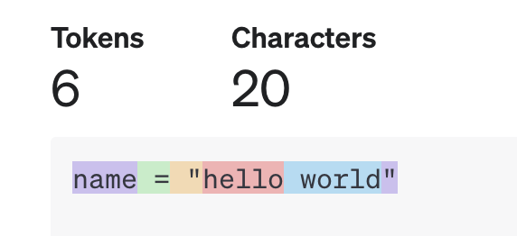

# 分词器Tokenizer在Copilot 中应用

## 什么是分词器

分词器是 NLP（natural language processing，自然语言处理）领域的一个重要部分，它可以把一段文本转换为小的单元，称为 token 。
token可以是单词、字符、标点符号等。这是很多 NLP 任务的基础步骤，尤其是在没有明确分词标记（如空格）的语言中（例如中文、日文、韩文），分词更显得尤为重要。
在基于 Transformer 的 LLM （Large Language Model，大语言模型）中，如 BERT 或 GPT 等，分词器扮演着更重要的角色。
大模型通过不断学习来发现 token 之间的联系，从而能够预测下一个 token，实现与人类对话的效果。

## 分词器主要作用

### 将文本转化为结构化数据
原始的文本数据通常是连续的字符串，不适合直接进行分析和处理。分词器的作用是将这些文本切分为一个个独立的词或短语，这些词或短语构成了可以进一步处理的基本单位。
通过分词，文本数据从非结构化的形式转变为结构化的形式，便于后续的处理和分析。
### 提升文本处理的准确性
在许多 NLP 任务中，如文本分类、信息检索、情感分析等，分词是提高处理准确性的关键步骤。准确的分词可以确保语义的正确解析，从而提升模型的性能。
例如，在情感分析中，分词器可以准确识别出表达情感的词语，从而更好地理解文本的情感倾向。
### 为后续 NLP 任务提供基础
分词是很多高级 NLP 任务的基础。例如：
  - 词性标注（POS tagging）：分词器将文本分割成单词，然后对每个单词进行词性标注。
  - 命名实体识别（NER）：通过分词，识别并提取出实体名称，如人名、地名、组织名等。
  - 依存句法分析：分词后，可以进一步分析词与词之间的语法关系。
### 处理语言中的多义性
在很多语言中，一个词或短语可能具有多种含义，分词器通过上下文可以帮助确定正确的词义。例如，在中文中，“苹果公司”可能指代一个公司，而“苹果”则可能是水果。准确的分词可以帮助系统理解文本中的多义词或短语的正确含义。
### 适应多语言环境
不同语言的分词难度和策略有所不同。比如，在英语中，单词之间通常有空格分隔，分词相对简单；而在中文、日文、韩文等语言中，单词之间没有明确的分隔符，这就需要分词器来进行精确的分割。因此，分词器在适应多语言处理环境时显得尤为重要。
### 支持搜索引擎的索引和查询
在搜索引擎中，分词器用于将用户输入的查询和文档中的文本进行分词，以便建立索引和进行高效的查询匹配。例如，当用户输入“自然语言处理”时，分词器会将其分为“自然”、“语言”、“处理”三个词，并在文档中搜索这些词的匹配。
### 提高机器翻译的效果
在机器翻译中，分词是理解和翻译句子的基础步骤。准确的分词可以帮助翻译系统更好地解析源语言，从而生成更加准确的目标语言翻译。例如，将中文“分词器的作用”正确分词为“分词器”、“的”、“作用”，可以更好地理解句子结构，提高翻译质量。
常见的分词器算法是基于子词的分词方法，如下面要讲的BEP分词算法。

## BEP分词算法实现
BPE（Byte Pair Encoding）算法最初是一种用于数据压缩的技术，但在自然语言处理（NLP）领域，它被用于分词任务，特别是将单词分解为子词（subwords）。这种方法在处理低资源语言、稀有词以及词汇表泛化方面具有显著优势。

BPE 的核心思想是通过反复合并文本中频率最高的字符对，逐步将字符组合成更长的子词单元，从而构建一个子词级别的词汇表。最终，文本可以通过这些子词进行分割和表示。这种方法允许模型在保持较小词汇表的同时，能够处理稀有词或未见过的新词。

### 初始化词汇表
BPE训练首先计算语料库中使用的唯一单词集，然后通过使用用于编写这些单词的所有符号来构建词汇表。作为一个非常简单的例子，假设我们的语料库使用这五个词：
```js
"hug", "pug", "pun", "bun", "hugs"
```
基本词汇表将是[“B”，“g”，“h”，“n”，“p”，“s”，“u”]。对于实际情况，基本词汇表将至少包含所有ASCII字符，可能还包含一些Unicode字符。如果您正在标记的示例使用的字符不在训练语料库中，则该字符将转换为未知标记。这就是为什么许多NLP模型在分析表情符号内容方面非常糟糕的原因之一。

### 统计所有相邻字符对的频率
现在假设这些单词有以下频率：
```js
("hug", 10), ("pug", 5), ("pun", 12), ("bun", 4), ("hugs", 5)
```
通过将每个单词拆分为字符（形成我们初始词汇表的字符）来开始训练，这样我们就可以将每个单词视为一个令牌列表:
```js
("h" "u" "g", 10), ("p" "u" "g", 5), ("p" "u" "n", 12), ("b" "u" "n", 4), ("h" "u" "g" "s", 5)
```
### 合并 merge
将两个连续的字节或字符组合起来以创建新的子字单元的过程。这对（“h”，“u”）出现在单词“hug”和“hugs”中，因此在语料库中总共出现了15次。而（“u”，“g”），它出现在“hug”、“pug”和“hugs”中，在词汇表中总共出现了20次。因此，第一个合并规则是（“u”，“g”）->“ug”，这意味着“ug”将被添加到词汇表中，并且该对应该在语料库的所有单词中合并。在这个阶段结束时，词汇表和语料库看起来像这样：

```js
Vocabulary: ["b", "g", "h", "n", "p", "s", "u", "ug"]
Corpus: ("h" "ug", 10), ("p" "ug", 5), ("p" "u" "n", 12), ("b" "u" "n", 4), ("h" "ug" "s", 5)
```
接着继续在新的Corpus中看是否可以有合并的子字单元，发现（“u”，“n”）在语料库中出现16次，因此学习的第二合并规则是（“u”，“n”）->“un”。将其添加到词汇表中并合并所有现有的子字单元，会形成新的词汇表和语料库：

```js
Vocabulary: ["b", "g", "h", "n", "p", "s", "u", "ug", "un"]
Corpus: ("h" "ug", 10), ("p" "ug", 5), ("p" "un", 12), ("b" "un", 4), ("h" "ug" "s", 5)
```

现在最常见的一对是（“h”，“ug”），所以我们学习合并规则（“h”，“ug”）->“hug”，这给了我们第一个三个字母的标记。合并后，语料库看起来像这样：

```js
Vocabulary: ["b", "g", "h", "n", "p", "s", "u", "ug", "un", "hug"]
Corpus: ("hug", 10), ("p" "ug", 5), ("p" "un", 12), ("b" "un", 4), ("hug" "s", 5)
```
继续执行合并，发现现在就是最佳的词汇表，如果再执行一次合并又会变回原来的单词。这也是BEP的缺点。

## BEP的优缺点
上面例子中的语料库很小，只是为了方便我们理解 BPE 的过程，但实际中语料库往往非常非常大，无法给每个词(token)都放在词表中。BPE 的优点就在于，可以很有效地平衡词典大小和编码步骤数。
而随着合并的次数增加，词表大小通常先增加后减小。迭代次数太小，大部分还是字母，没什么意义；迭代次数多，又重新变回了原来那几个词。所以词表大小要取一个中间值。


而常见缺点如下：
- 上下文无关的合并：BPE 仅基于频率合并子词单元，而不考虑它们出现的上下文。这可能导致在不同语言环境中，子词表示效果不佳。

## BEP代码实现
请参考subword-nmt

## 分词器在代码补全里的应用
代码补全是 LLM 的一个应用场景，在编辑器中安装 Copilot 插件后，在编写代码时，就能自动获取实时的补全建议，提高开发速度。Copilot插件的工作原理如下：
- 理解上下文：当开发者编写代码的时候，Copilot 会持续地分析当前的上下文，包括当前正在输入的代码、注释、和文件中的其他代码。同时，还会分析项目整体结构和用到的库。
- 向模型发送请求： 基于当前上下文，Copilot 会给 LLM 发送一个请求。该请求会包含相关的代码上下文，例如：光标前的代码、光标后的代码、函数名称和注释等。
- LLM 生成补全建议： LLM 收到请求信息后，基于它从大量公共代码库学到的知识和当前项目的具体上下文信息，生成多个代码建议。
- 展示补全建议：Copilot 会把多个代码建议显示到编辑器中，开发者可以采纳、拒绝或修改补全代码。

在代码补全插件中，编码器是一个核心的功能模块，它会把代码分割为token，包括：关键词、运算符、单词、标点符号、空格等。假设我们输入一行代码：

```python
name = "hello world"
```

编码器会把代码拆分为几个独立部分：


再把每个部分进行编码形成`Token IDs`，具体结果为：
```js
[609, 284, 330, 15339, 1917, 1]
```

由上可以看出，分词器能够计算出每段代码的token数量，在向LLM发送请求前，Copilot会先检查当前 Prompt 的token数量是否超过了 LLM 的阈值，如果超出，就需要对 Prompt 进行截取，避免由于 token 超出指定范围而导致代码补全失败。因此，分词器的作用不言而喻，如果不能精确的计算token数量，会影响开发者的使用体验。

## 参考
- https://platform.openai.com/tokenizer
- https://huggingface.co/learn/nlp-course/en/chapter6/5
- https://www.geeksforgeeks.org/byte-pair-encoding-bpe-in-nlp/
- https://web.stanford.edu/~jurafsky/slp3/2.pdf
- [BPE 算法原理及使用指南【深入浅出】-CSDN博客](https://blog.csdn.net/sinat_37574187/article/details/136120451?utm_medium=distribute.pc_relevant.none-task-blog-2~default~baidujs_baidulandingword~default-0-136120451-blog-118855185.235^v43^pc_blog_bottom_relevance_base6&spm=1001.2101.3001.4242.1&utm_relevant_index=1)
- https://xin-xia.github.io/publication/rjxb203.pdf
