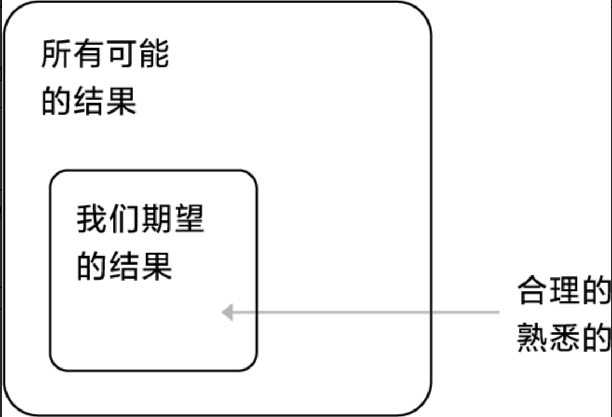
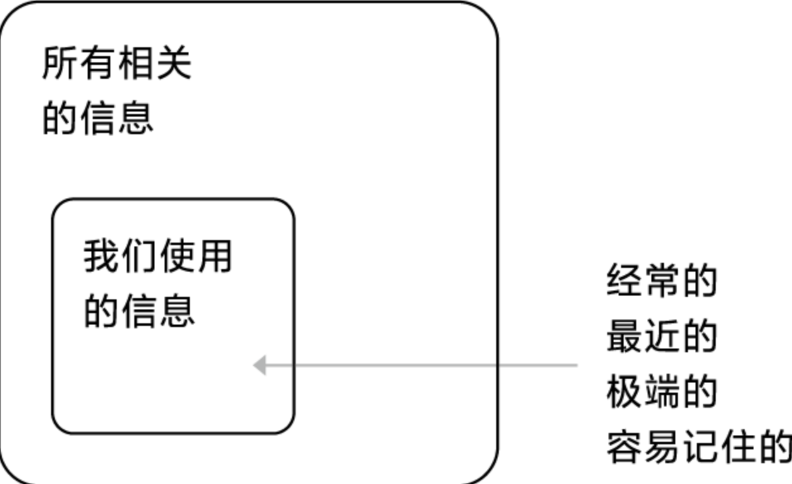

# 可得性偏差

所谓的“可得性偏差”，是指根据最近可以获得的信息，使你对现实的客观认知在无意中出现了偏差或失真。

可得性偏差产生的主要原因就是过分依赖自己参照系中发生的事情。

在物理学中，你的视角被称为“参照系”（frame ofreference），这也是爱因斯坦相对论中的核心概念。但是在日常生活中，从不同参照系看同一事物都是不一样的。

## 可得性偏差在日常生活的应用

当你向同事或家人说明某个重要问题时，会试着以有助于他们理解的方式进行描述，为展开对你有益的对话奠定基础。例如，你希望自己所在的机构开展一个耗费巨资的新项目，你就会告诉同事，这是一个超越竞争对手的潜在机会，而不会说这是一项需要投入大量资源的冒险活动。如果你用的是后一种描述方式，很可能会被无情地拒绝。

上面是一个最基础的示例，而在新闻标题中，为了吸引读者的眼球或者实现调动公众舆论而实现个人目的这种"可得性偏差"的思维模型表现的更加常见。

## 在决策中如何避免可得性偏差

## 参考