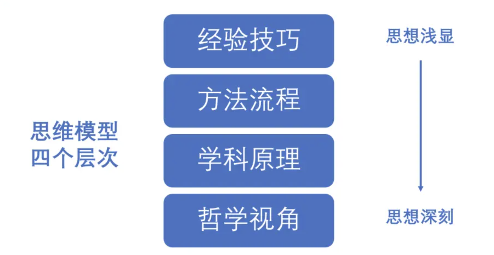
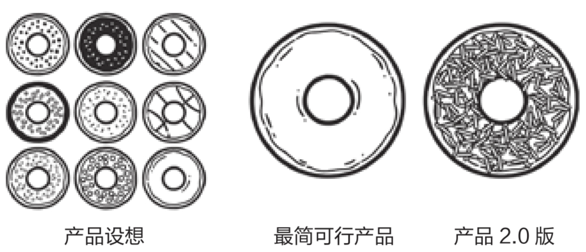

# 第一性原理

“经验”或“方法论”在解决日常生活中的问题时，是大多数人的首选，但“经验”或“方法论”只能算得上一种比较浅的思考方式。在很多书籍上都记载了四层思维模型，如下图：



我们简要总结下这四层思维模型的特点：

|类型|例子|特点|
|---|---|---|
|经验技巧|基于自身经验或前辈教导得到的|小样本启发式总结|
|方法论|本质还是经验总结，不过这些“经验”经过更多的验证形成了标准与流程，例如：SWOT分析|大样本经验流程化|
|科学原理|例如：数学中公理|科学方法验证原理|
|哲学思维|黑格尔的辩证法三大定律：“对立统一规律” “量变质变规律” “否定之否定规律”|理想思辨思维方式|

在这里我觉得有必要介绍下哲学思维里黑格尔的辩证法的三大定律：“对立统一规律” “量变质变规律” ，这个很有意思：

|类型|例子|
|---|---|
|对立统一规律|事物内部矛盾是事物发展变化的源泉、动力，推动事物发展。从牛顿力学到相对论再到量子力学，哪一个不是事物的矛盾推动科学定理的演进|
|量变质变规律|事物因矛盾引起的发展过程和状态、发展变化形式上具有的特点，从量变开始，质变是量变的终结。|
|否定之否定规律|矛盾运动过程具有的特点，它告诉人们，矛盾运动是生命力的表现，其特点是自我否定、向对立面转化。|

其中否定之否定是我最喜欢的定律，即初时的“开山是山，开水是水”，到中期的“开山不是山，开水不是水”，再到大圆满期的“开山是山，开水是水”；其中奥秘无穷！

而本文介绍的"第一性原理"属于哲学思维（又是也说是科学原理着一层），它是一种基于哲学原理的思维方式。

## 什么是第一性原理

每个称职的科学或数学老师都会强调“弄清你使用的每个公式是怎么推导出来的”，因为只有这样，你才能真正理解这些公式。能只用一张白纸就解决数学问题，和需要别人提供公式才能解题，两者之间存在很大的区别。真正的大厨（不用看菜谱就能选取食材，将它们变成令人赞叹的美味佳肴）和只知道怎么按菜谱做菜的厨子，两者同样截然不同。

能帮你成为“思维大厨”的核心思维模型叫作从第一性原理出发（arguing from first principles）。指的是自下而上地思考问题，运用你认为是正确的基本构件得出合理的（有时是全新的）结论。所谓的“第一性原理”是一套不言而喻的假设，也是构成你结论的基础。它们就好比菜谱中的食材，或是公式背后的数学公理。

## 从第一性原理出发

如果你能从第一性原理出发，就能更轻松地应对不熟悉的情况，或者以创新的方式应对熟悉的情况。了解公式是怎么推导出来的，有助于弄清如何推导新公式。了解分子是怎么组合起来的，有助于构建新分子。在接受硅谷的创业月度访谈节目《基地》（Foundation）采访时，特斯拉的创始人埃隆·马斯克（Elon Musk）阐述了这个过程实际是怎么运作的：

第一性原理就像从物理的角度看待这个世界……你将事物归结为最基本的事实，然后说：“我们确信的哪些事是真实的？”……然后以此为基础开始推论……

有人可能会说：“电池组真的很贵，而且以后都会这么贵……它过去每千瓦时的成本是600美元，将来价格也不会好到哪里去……

从第一性原理出发，你会说：“构成电池的原料是什么？这些原料的现货市场价值是多少？”……电池是由钴、镍、铝、碳、一些起间隔作用的聚合物，加上密封金属罐组成的。如果我们把它分解成最基础的原料，然后想一想：“如果我们去伦敦金属交易所买这些原料，那么要花多少钱？”

大约每千瓦时80美元。所以，很显然，你只需要想个巧妙的方法，把这些原料组合成电池的样子，就能得到比人们想象中便宜得多的电池。

从第一性原理出发的时候，你是刻意“从零开始”，避开传统智慧存在的潜在陷阱，因为它们很可能是错的。通过运用第一性原理，即使你最终接纳了传统智慧，也将对手头的主题有更深入的了解。

任何问题都能用第一性原理加以解决。以换工作为例，大多数求职者都会广投简历，接受愿意雇用自己的第一份工作，但那可能并不是你的最佳选择。如果你运用第一性原理，一开始就会思考自己在工作中的真正价值（自主权、地位、任务等）、想要的工作待遇（薪酬、职位、头衔等）和以往的工作经验。将这些东西统统加起来，就能弄清下一步怎么走更适合自己。然后，你就可以积极主动地求职了。

不过，即使从第一性原理出发，如果你光是空想，最多也只能走到这一步了。第一性原理仅仅是假设。这些假设可能是对的，也可能是错的，还可能是介于两者之间的。你真的在乎工作中的自主权吗？还是说，你只是认为自己在乎这个？为了能换工作，你真的需要重返学校吗？还是说，其实完全没必要这么做？

## 去风险化

运用“第一性原理”你分析出了问题的“本质”或“基本要素”，但是“本质”或“基本要素”是否是客观存在的或正确的呢？你分析出的“本质”或“基本要素”很可能本身就是错的。现实生活构成问题的“本质”或“基本要素”并不像科学世界里的原子组成模型那样稳定可靠，而是会受到各种因素的影响。


所以，你还需要在现实世界中测试自己的假设。这个过程被称为“去风险化”（de-risking）。你的一个或多个假设可能存在“不成立”的风险，因此得出的结论也可能是错的。

```
“去风险化”是测试自己的假设是否成立。
```

### 如何去风险化

你可以给任何东西“去风险化”：政策构想、度假安排、健身计划。在“去风险化”的时候，你需要迅速轻松地检验假设。以做度假安排为例，需要检验的假设涉及成本（“我的收入能负担得起这次度假”）、满意度（“我可以好好享受这个假期”）、协作（“我的亲戚也可以加入”）等方面。“去风险化”其实很简单，只需要花几分钟时间上网搜索，读读其他网友做出的评价，然后发邮件邀请亲戚参加就行。

不幸的是，在现实生活中，人们常常犯下这样的错误——在检验假设之前就做太多的事。

#### 避免过早优化（premature optimization）

在计算机领域，这种陷阱被称为“过早优化”（premature optimization），也就是你提前太多（过早）调整或完善代码与算法（做优化）。如果你的假设被证明是错误的，你就不得不放弃之前做的所有工作，说到底就是浪费时间。就像你认定亲戚肯定会来做客，提前预订好了吃住行，结果问了才发现他们来不了。于是，你不得不回头更改所有预订。其实，只要提前简单沟通一下，就能避免这些无用功。

#### minimum viable product，简称MVP

还有一个思维模型也能帮你去风险化（检验假设），那就是所谓的“最简可行产品”（minimum viable product，简称MVP）。MVP是你开发的一款产品，它拥有够用的功能、最小的体量，能够由真实消费者做可行性测试。



“最简可行产品”会迫使你迅速评估自己的假设。错误的做法是，在明显能做出更简单的假设时，预先提出太多或太复杂的假设。在这种情况下，“奥卡姆的剃刀”（Ockham's razor）会对你有所帮助。它指出，最简单的解释最有可能是正确的。当你面对许多看起来都能合理解释一组数据的假设时，不妨先选择最简单的一个研究一番。

这个思维模型之所以被称为剃刀，是因为它能“剃除”不必要的假设。这个名称来自14世纪英国哲学家奥卡姆的威廉（William of Ockham），不过它的核心概念能追溯到更久之前。希腊裔罗马天文学家托勒密（约90—168）说过：“我们认为，用最简单的假设来解释现象，这是个很好的原则。”后来，作曲家罗杰·塞欣斯（Roger Sessions）用自己的话阐述了艾伯特·爱因斯坦（Albert Einstein）的名言：“一切应该力求简单，但又不能过于简单！”医学界有句俗话说得好：“听到蹄声时，请先想到马，而不是斑马。”

这个模型的实际应用方法是，审视你对某种情况的解释，将其分解为若干基本假设，然后针对每个假设问自己：这个假设是不是真的有必要存在？有什么证据能证明我需要保留这个假设？我依赖这个假设是错的吗？

“奥卡姆的剃刀”不是永远正确的法则，只是为人们提供指导。有时候，真正的解释确实极其复杂。不过，当你有更简单的解释方法时，没理由再去选择复杂的解释。

## 总结

通过“第一性原理”你分析出了问题的“本质”或“基本要素”，但为了确保这些“本质”或“基本要素”是客观的，你可能还需要通过去风险的方法来验证假设。

以上所有建议都可以简称为“KISS”——保持简洁，笨蛋！（Keep It Simple, Stupid!）针对某个问题制订解决方案时，无论是做决策还是解释数据，最好都从你能想到的、最简单的假设出发，用尽可能简单的方式为它们“去风险化”。

## 参考

- 《思维模型》- 加布里埃尔·温伯格  劳伦·麦肯
